

# MatFinder — Screenshots

###  [Overview](README.md) ·  [Screenshots](SCREENSHOTS.md)

A visual tour of MatFinder and its built-in XRD suite, **PhaseDRX**.

---

## 🔬 Material discovery

### Search multiple databases at once
Query the **Materials Project**, **OQMD**, **COD** and **ROD** by element. Results list the
space group, band gap, formation energy and a color-coded thermodynamic stability — alongside
favorites, external-database links, a Sci-Hub DOI downloader and quick article search.

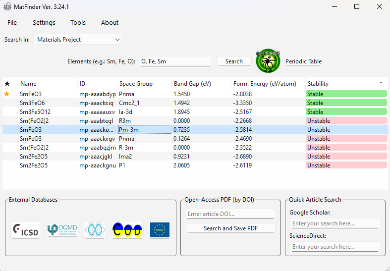

### Send a structure straight to analysis
Right-click any result to open it on the Materials Project, download its CIF, fetch the matching
**ICSD** collection codes, or **export the CIF directly into PhaseDRX** — no manual download/reload.

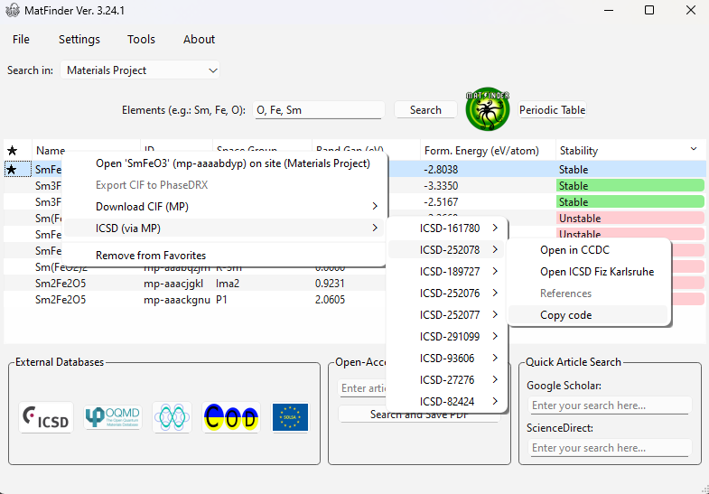

### One search box, four databases
Switch between Materials Project, OQMD, COD and ROD from a single dropdown.

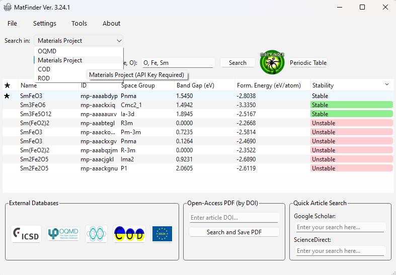

---

## 📈 PhaseDRX — XRD analysis suite

### Project-based workflow
PhaseDRX opens with a project launcher: start a new project, reopen an existing one, or work in
an anonymous session.

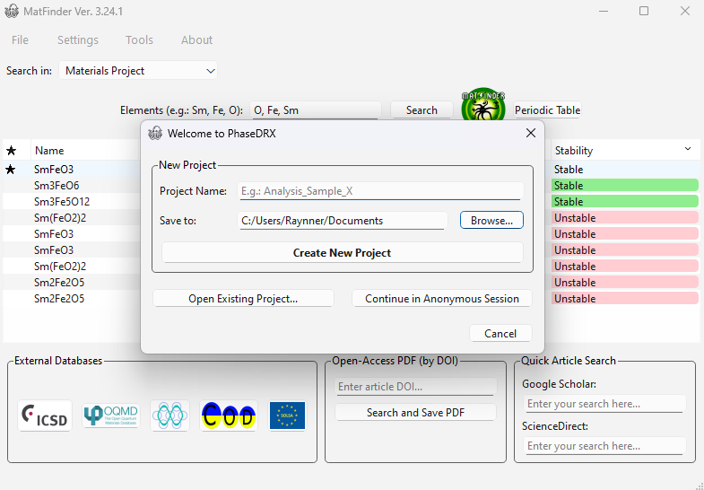

### Experimental data workspace
Load experimental XRD patterns and clean them up with normalization, smoothing, background
removal (SNIP / polynomial) and wavelet denoising. Toggle between the **2D diffractogram** and the
**3D crystal structure**.

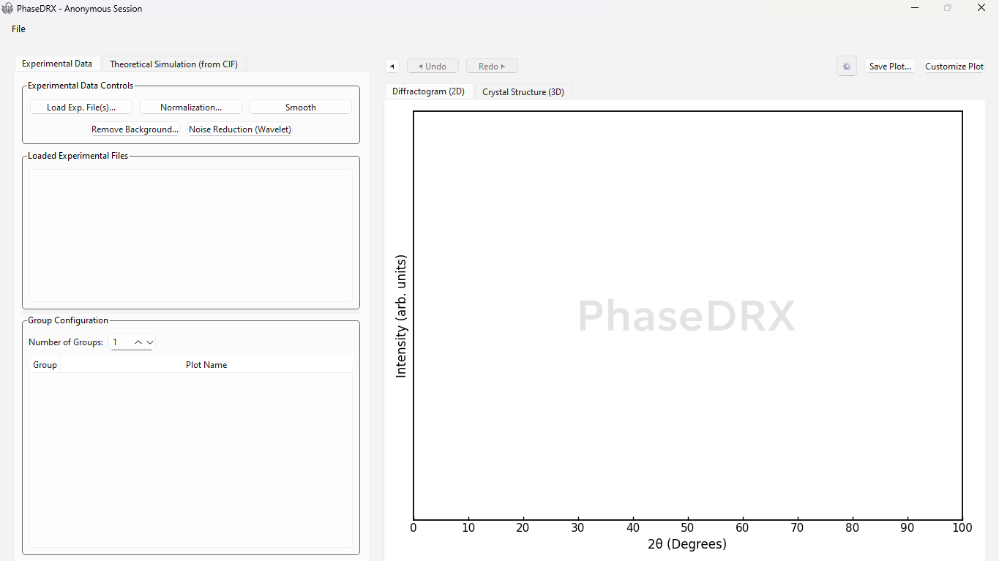

### Interactive 3D crystal structure
Render and rotate the unit cell straight from a CIF (here **SmFeO₃**), with an element legend and
lattice parameters, then simulate its diffraction pattern for a chosen radiation source.

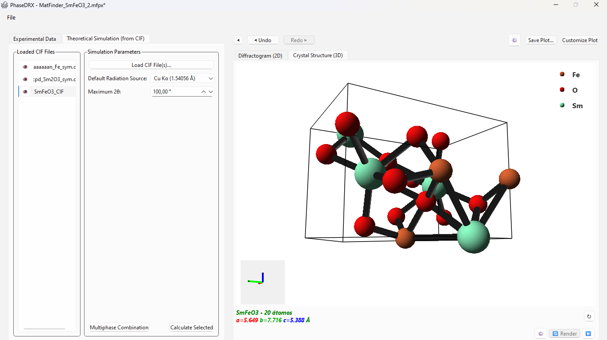

### Compare calculated vs. experimental
Overlay simulated CIF patterns on experimental data and read any peak's **2θ, intensity and
d-spacing** with a single click.

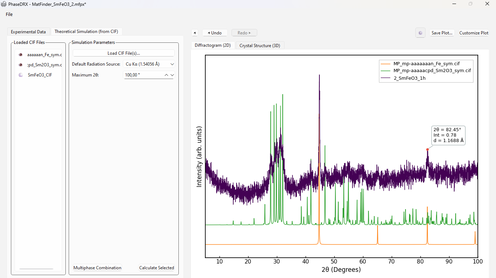

### Crystallographic editor with Auto-Fit
Refine the unit-cell parameters (with **Auto-Fit**) and tune the peak profile (Pseudo-Voigt, FWHM)
until the simulation matches the measured pattern.

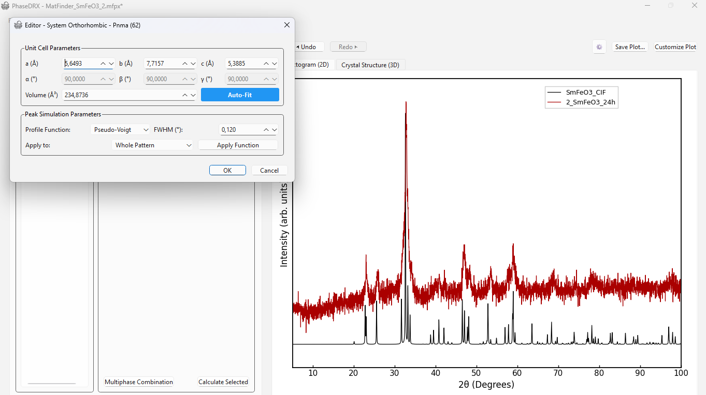

### Stack and compare a whole series
Stack many diffractograms to follow how a sample evolves over time, all against the reference patterns.

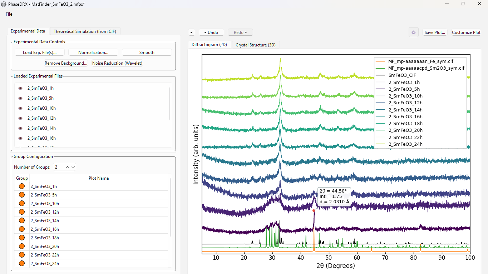

---

## 🖼️ Publication-ready figures

### Phase identification
Export clean, annotated figures — the experimental pattern against candidate phases
(Fe, Sm₂O₃) with labeled reflections.

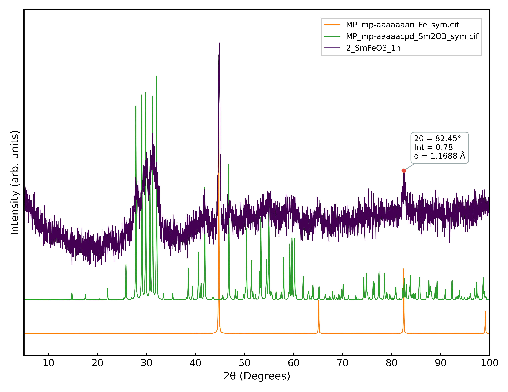

### Phase-evolution study
A full synthesis time series (**1 h → 24 h**) of SmFeO₃, stacked over the reference CIF patterns.

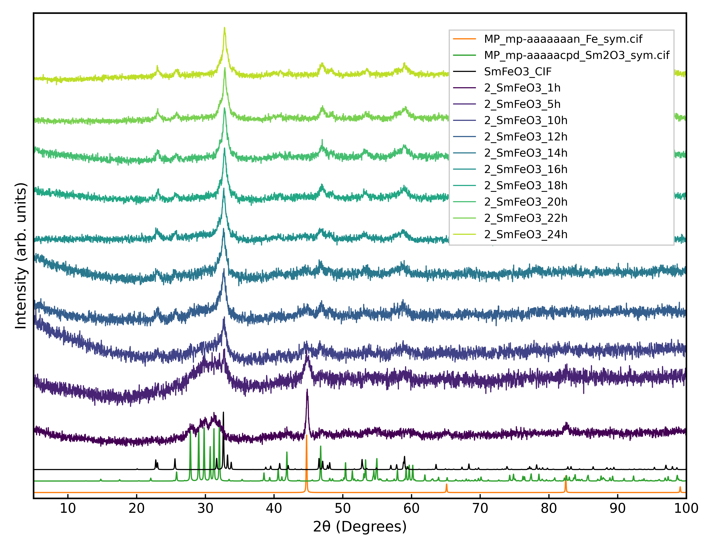

---

📖 **[Back to Overview](README.md)**

